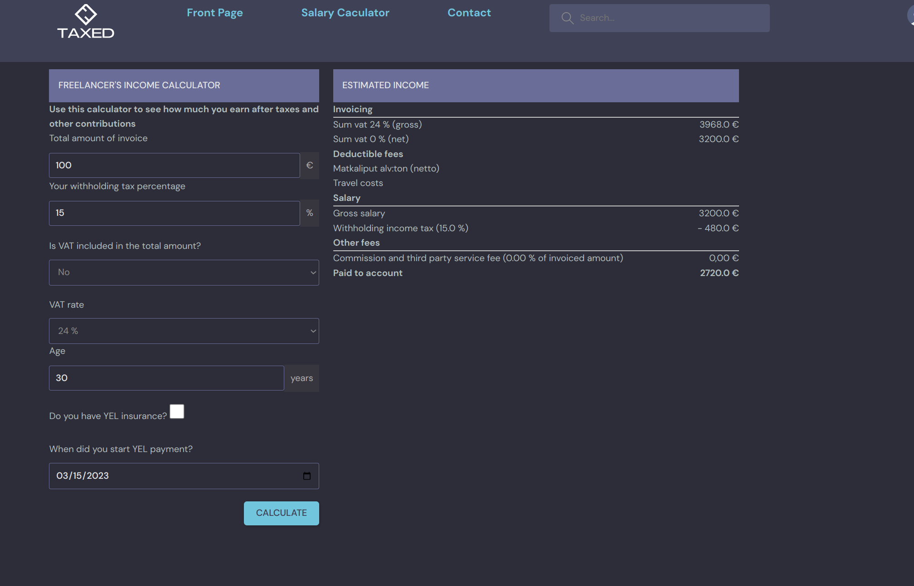
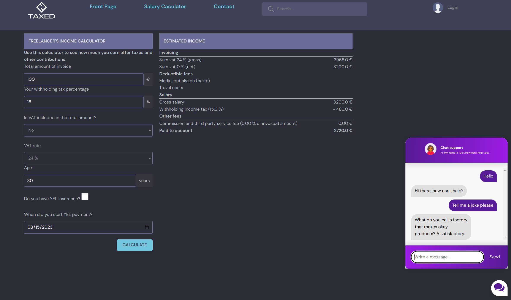

<div align="center">


# Taxed Website
</div>

### Cloning the repository

--> Clone the repository using the command below :
```bash
git clone https://github.com/hienng9/taxed.git

```

--> Move into the directory where we have the project files : 
```bash
cd taxed

```

--> Create a virtual environment :
```bash
# Let's install virtualenv first if you have not already
pip install virtualenv

# Then we create our virtual environment
virtualenv envname

```

--> Activate the virtual environment using either:
```bash
envname/scripts/activate

```
or
```bash
source envname/bin/activate

```

--> Install the requirements :
```bash
pip install -r requirements.txt

```

#

### Running the App

--> To run the App, in the same directory, open one terminal:

```bash
python3 -m celery -A taxedwebsite worker -l info

```
open another terminal, run the following:

```bash
python3 manage.py runserver

```

> ⚠ Then, the development server will be started at http://127.0.0.1:8000/

#

### App Preview :

<table width="100%"> 
<tr>
<td width="50%">      
&nbsp; 
<br>
<p align="center">
  Salary Calculator
</p>

</td> 
<td width="50%">
<br>
<p align="center">
  Chat Bot
</p>
  
</td>
</table>


