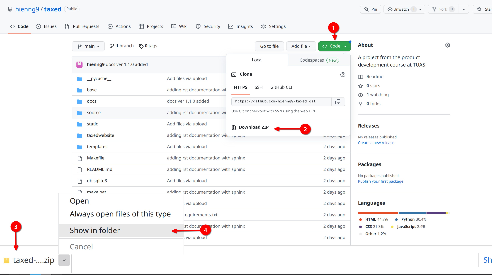

=======================================
Installation guide for testing purpose
=======================================

In this section, you will be guided on how to download the prototype, create virtual environment, install dependencies and run the website.
If you have any problem, please feel free to contact me via email hien.nguyen@edu.turkuamk.fi or WhatsApp +358 46 8404770

System requirements
=======================================

Python version 3

If you have not installed, please visit to https://www.python.org/ and comeback once it is installed.

Cloning the repository
=======================================

1. Clone the repository using the command below::
    
    $ git clone https://github.com/hienng9/taxed.git

Or download the project directly from https://github.com/hienng9/taxed and extract the zip file to any location that you wish.

2. In case you use git to clone the project, continue by moving into the directory where we have the project files::

    $ cd taxed

In case you download the project, then open your terminal to change to the directory where the project is located.
From this point on, we will be using the terminal.

Creating a virtual environment
==============================================

Let's install virtualenv first if you have not already::

    $ pip install virtualenv

Then we create our virtual environment::

    $ virtualenv envname

Activate the virtual environment using either::

    $ envname/scripts/activate

or::

    $ source envname/bin/activate

Install the requirements::

    $ pip install -r requirements.txt

Running the App
======================================

To run the App, in the same directory, open one terminal::

    $ python -m celery -A taxedwebsite worker -l info

open another terminal, run the following::

    $ python manage.py runserver

Then, the development server will be started at http://127.0.0.1:8000/

