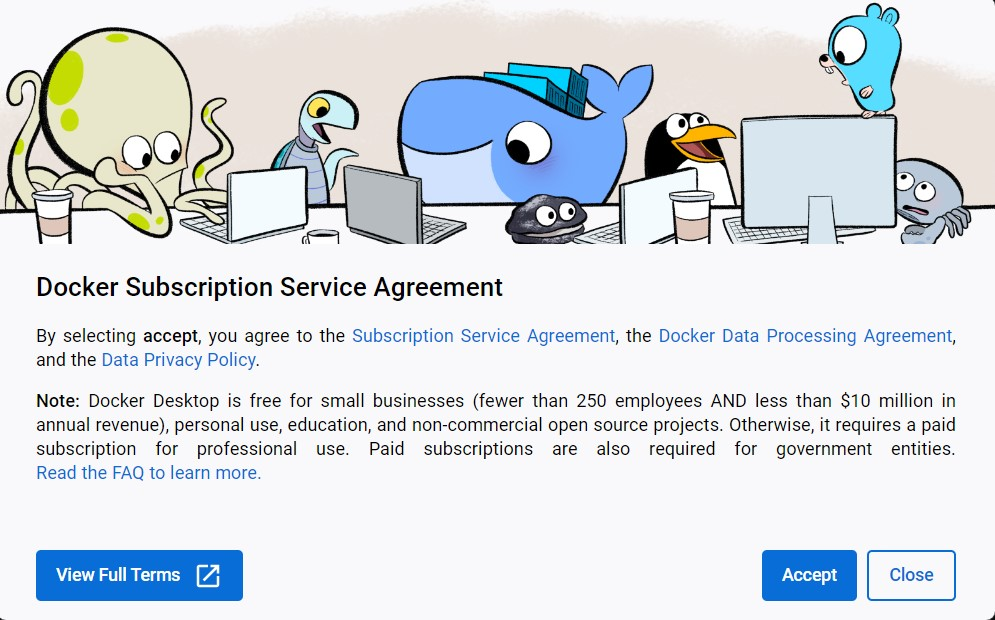
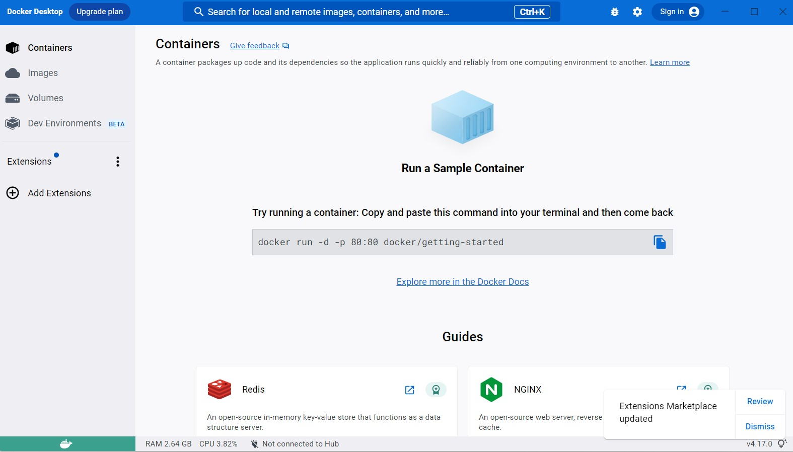
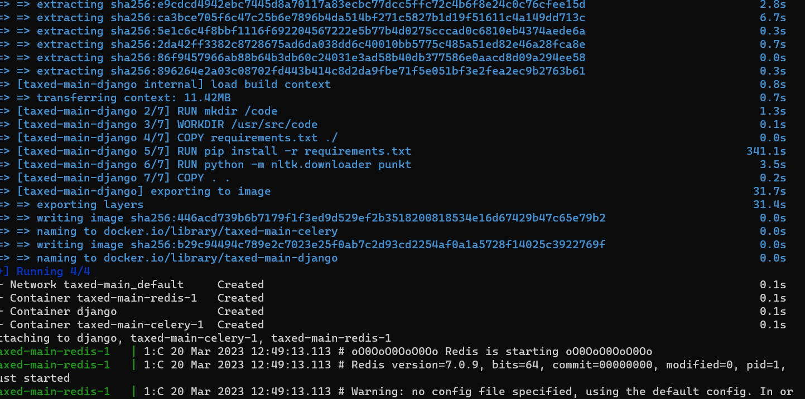

=======================================
Installation guide for testing purpose
=======================================

In this section, you will be guided on how to download the prototype, create virtual environment, install dependencies and run the website.
If you have any problem, please feel free to contact me via email hien.nguyen@edu.turkuamk.fi or WhatsApp +358 46 8404770

System requirements
=======================================

1. Python version 3

If you have not installed, please visit to https://www.python.org/ and comeback once it is installed.

2. Docker for desktop
On Windows: https://docs.docker.com/desktop/install/windows-install/
On Mac: https://docs.docker.com/desktop/install/mac-install/
On Linux: https://docs.docker.com/desktop/install/linux-install/
On Ubuntu: https://docs.docker.com/desktop/install/ubuntu/

Making sure Docker Desktop is running:
=================================================
After Docker Desktop is installed, open it.

Accept terms and condition when asked.

After starting period, the Docker Desktop will appear as followed:

Cloning the repository
=======================================

1. Clone the repository using the command below::
    
    $ git clone https://github.com/hienng9/taxed.git

Or download the project directly from https://github.com/hienng9/taxed and extract the zip file to any location that you wish.

.. image:: download-git.png

2. In case you use git to clone the project, continue by moving into the directory where we have the project files::

    $ cd taxed

Otherwise, extract the download file, open your terminal to change to the directory where the project is extracted and go to the folder name taxed.
From this point on, we will be using the terminal.

Creating a virtual environment
==============================================

Let's install virtualenv first if you have not already::

    $ pip install virtualenv

Then we create our virtual environment::

    $ virtualenv envname

Activate the virtual environment using either on Windows::

    $ envname/Scripts/activate

or on Linux or Mac::

    $ source envname/bin/activate

Finally, run the following command on Windows::
    $ docker-compose up

On Mac or Linux use::
    $ sudo docker-compose up
Waiting for all the neccessary dependencies are installed and images are created. You should have the following:

After that, open a web browser and go to http://127.0.0.1:8000/

Press Control-C to end the below command.
