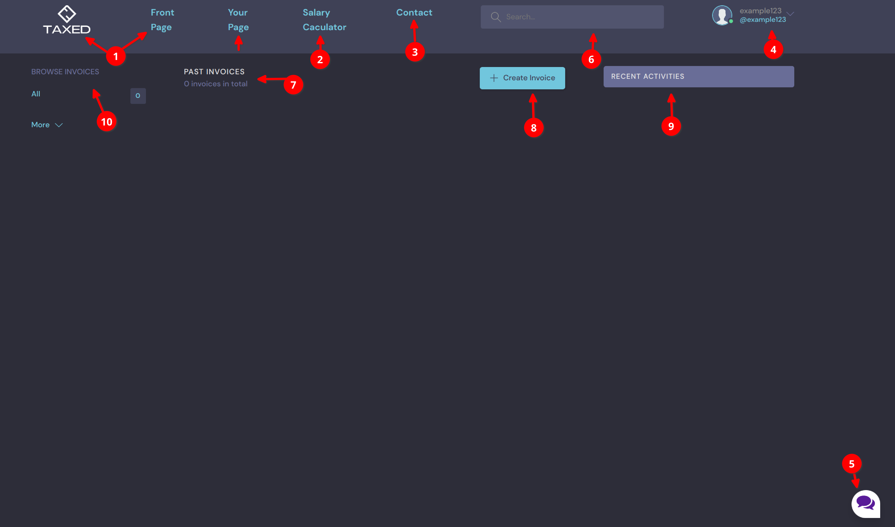
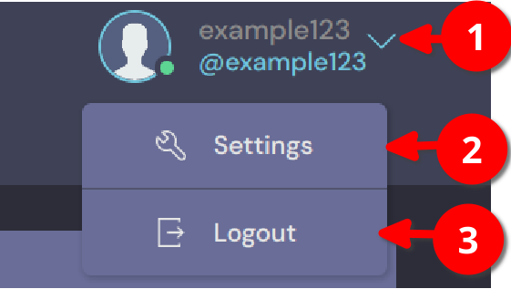

===================================
How to navigate through the website
===================================

In this section, you will know more about navigating in the website.

If you are not logged in, then all you see is the front page tab, salary calculator tab, contact tab and login logo.

.. image:: navbar-notloggedin.png

1. Click on "front page" or the logo image  will lead you to the first page of the website where you can find a lot information about the company, products and services. It is right now still under construction.
2. "Salary calculator" will lead you to the income calculator where you can know how much you earn after taxes and other funds as well as insurance.
3. Click on Contact tab if you have any questions or you want to contact us.
4. Click on Login to login into account or register new user.
5. Click on the image of messages to start having a conversation with website's chatbot Tuuli.
6. Search bar where you can search for information on the website.

For logged-in users, there are information and tabs.

Information in number 1, 2, 3, 5 and 6 are the same as anonymous users. Logged in users have their own page where they can browse their invoices (#10), create invoice (#8), see past invoices (#9) and check recent activities on the website.

Logged in users can update their information in settings and log out.

