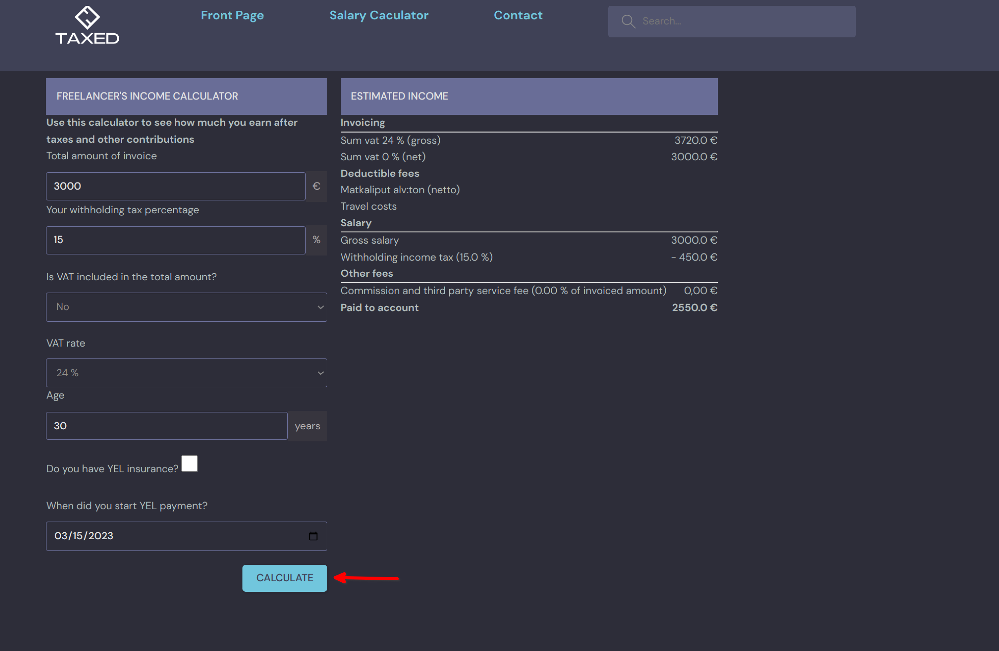

=============================
How to use salary calculator
=============================

In this section, you will find information on using the salary calculator.

Head to the nagivation bar and choose the tab salary calculator.

Fill in the form the following information.

1. Total amount of invoice. For example, 3000 euros. In case you are paid hourly and want to charge customers 30 hours for 20 euros per hour, then the total amount of invoice will be 3000 euros.
2. Your widthholding tax percentage. This can be found in your tax card.
3. Is VAT included in the total amount of invoice?
4. if Vat is included int the amount invoicing, please choose the vat rates, either 24%, 10% or 0%.
5. Age of user. This will be used when user is YEL-reliable.
6. Are you YEL-reliable? An entrepreneur are obliged to take out YEL insurance when their yearly income exceeds a certain amount.
7. The date when you start taking out YEL insurance. This is used to calculate the percentage of YEL insurance fee that you have to pay.

Click Calculate to show the estimated income after taxes and other fees.

