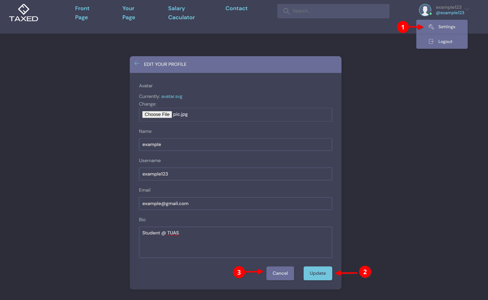
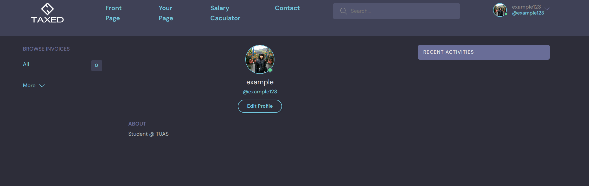

==============================
How to update user information
==============================

In this section, you will be guided on how to change profile picture and update bio information.
First, click on the setting in our avartar logo.

Second, choose a profile picture from computer, update your name and fill in the bio section. Please note that the bio section is not allowed to be empty at this stage.

At final step, click on update to update information or cancel to go back to previous page.

If you click on update, you will land on the profile page as follows.

