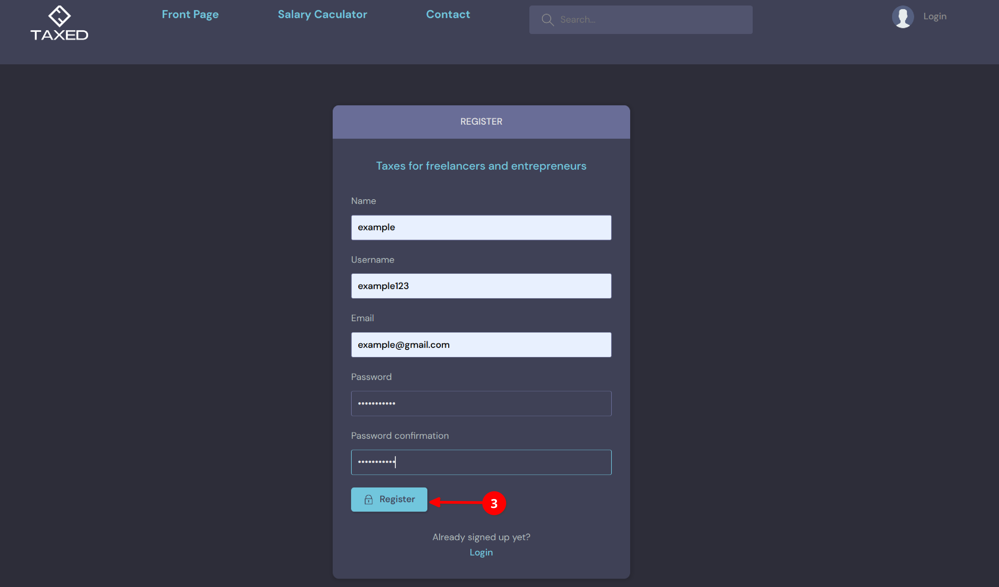
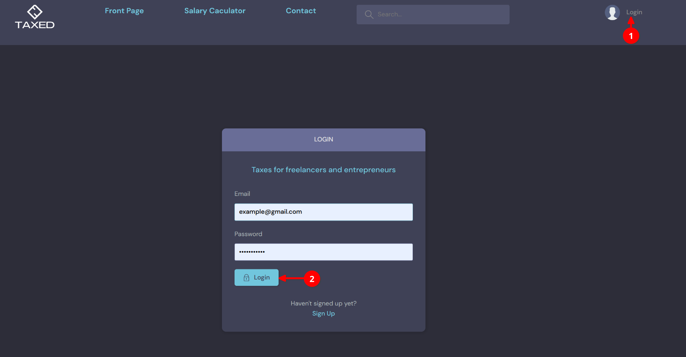
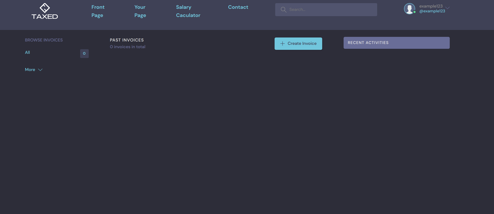

===================================
User registration, Login and Logout
===================================

In this section, you will find information on how to create a user acount.

If you have not had an account yet, register by click on the Login on the top right corner.
When a login box appears, click on sign up to start fill in information.

.. image:: signup1.png

In the registration form, fill in all the necessary information such as name, username, email and password. After that, click on "register" button.

In case you already had an account, 

Either you register new user or login, at the final step, your landing page will be as belows:

